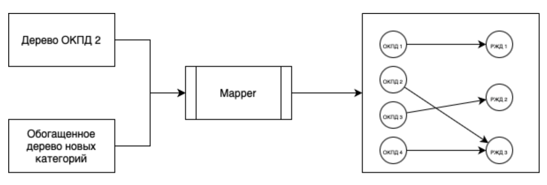

# Преобразование каталога товаров ОАО «РЖД»
**Краткое описание решения**

Наше решение состоит из четырех шагов:
1. Составление дерева категорий и их атрибутов
2. Обогащение специфичными для РЖД данными
3. Преобразование старого каталога в новый с помощи нейронной сети BERT
4. Извлечение характеристик из текстового описания с помощью большой языковой модели

**Технические особенности**

Python, BERT, LLM, API

**Уникальность решения в одну строчку**

Использование передовых языковых моделей для преобразования каталога и извлечения характеристик с возможностью их обогащения для конкретной отрасли
## Архитектурна решения
Наше решение состоит из следующих модулей:
- Chopper
- Filler
- Mapper
- Extractor


### Модуль Chopper

Занимается созданием дерева новых категорий и выделением атрибутов для новых категорий

В результате мы получаем дерево категорий и их атрибуты.


### Модуль Filler

Занимается обогащением дерева и атрибутов с учетом специфики каталога РЖД. Потому что на Яндекс.Маркете не продают рельсы и тому подобное

Сейчас у нас это никак не реализовано, поэтому можно повесить лапшу на уши

В результате мы получаем обогащенное дерево категорий и их атрибуты


### Модуль Mapper

Занимается сопоставлением категорий из дерева ОКПД 2 в обогащенным деревом новых категорий.

В результате мы получаем сопоставление каждой категории из ОКПД 2 на какую-то новую категорию.


### Extractor

Занимается выделением характеристик товара из его описания


## Yandex Cloud
Yandex Cloud используется для запросов к API YaGPT. Для корректной работы API, необходимо перед запуском указать `IAM_TOKEN` и `FOLDER_ID`. 
Подробное описание, как можно получить значения токена и folder_id, можно найти [тут](https://yandex.cloud/ru/docs/foundation-models/quickstart/yandexgpt)
```bash
export FOLDER_ID=<идентификатор_каталога>
export IAM_TOKEN=<IAM-токен>
curl \
  --request POST \
  --header "Content-Type: application/json" \
  --header "Authorization: Bearer ${IAM_TOKEN}" \
  --header "x-folder-id: ${FOLDER_ID}" \
  --data "@prompt.json" \
  "https://llm.api.cloud.yandex.net/foundationModels/v1/completion"
```

## Usage
Весь проект запускается в Docker-контейнере.

Сначала экспортируем нужные переменные окружения:
```bash
export FOLDER_ID=<идентификатор_каталога>
export IAM_TOKEN=<IAM-токен>
```

Соберем образ:
```bash
docker build --tag 'app' --build-arg iam_token=$IAM_TOKEN --build-arg folder_id=$FOLDER_ID .
```

Запускаем образ с прокидыванием портов:
```bash
docker run -p 8501:8501 'app'
```